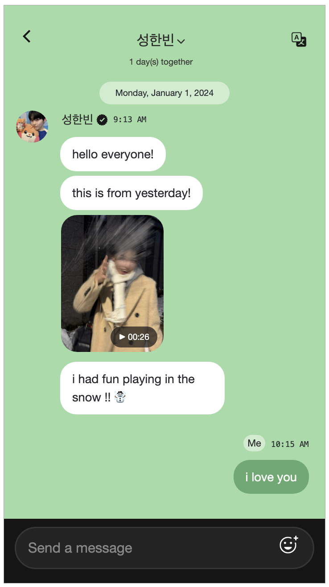
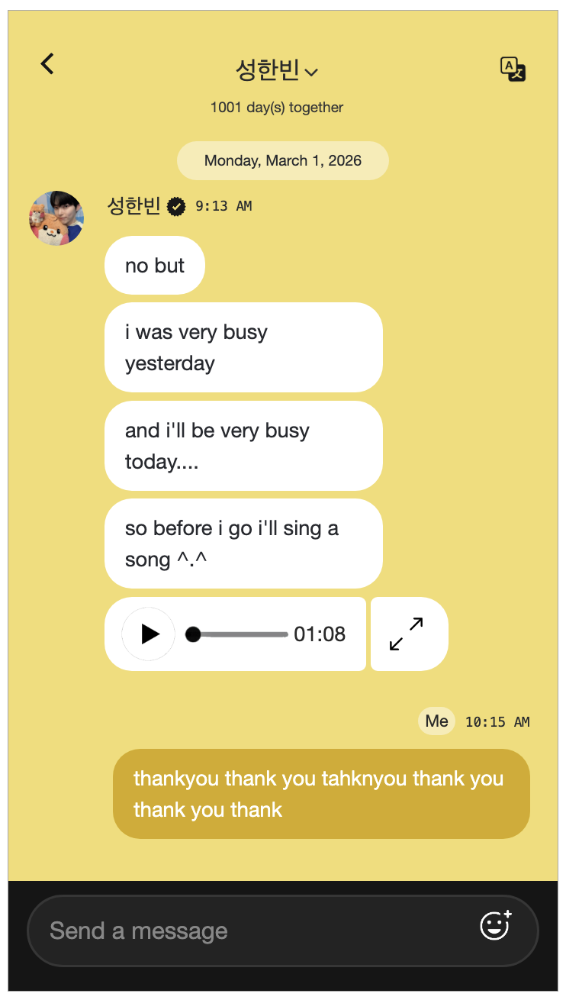
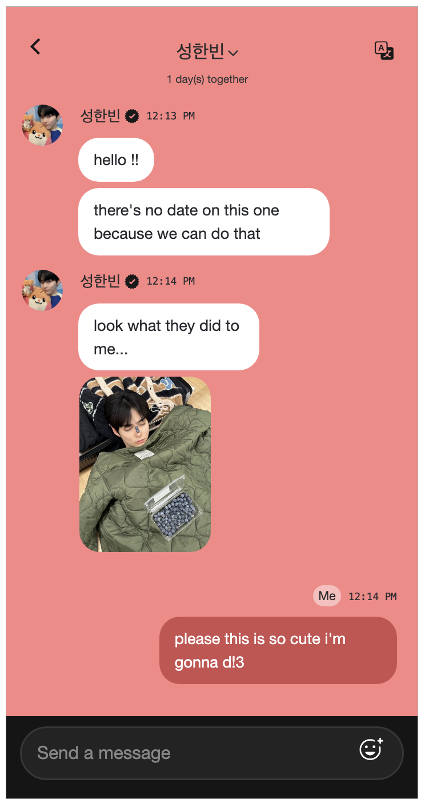
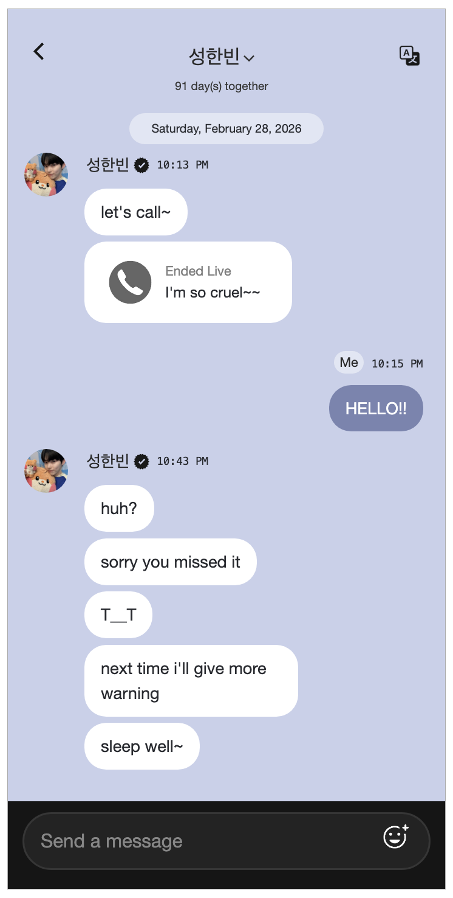
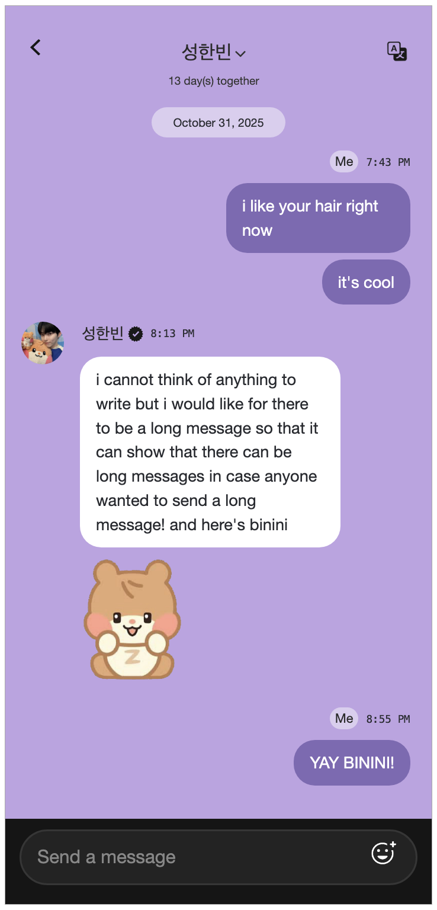

# Archive of Our Own - Plus Chat Work Skin
An AO3 Work Skin for idol messaging system Plus Chat (adaptable for other messaging systems) using CSS and HTML. 

## Previews

	

	

		
		
		
		
		
	

## Rules of Usage

This work skin is free to use for everybody, and free to take and adjust as you please—in fact I encourage you to do so!

If you use it OR work off of it to make something on your own, I ask that you please credit me by either of these means:

1. Linking the GitHub or AO3 page for this workskin, with credit
2. Using the 'This work is a remix, a translation, a podfic, or was inspired by another work' option on AO3

Thank you for your kindness and understanding!

## How To Use (Basic)

[See [AO3's How To Use Work Skins](https://archiveofourown.org/admin_posts/1370) article, and the 'Editing [files]' sections below if you need more information and assistance.]

1. Open up the 'skin' folder in this repository, and click on 'pluschat.css', then copy the contents of the file <em>(On the header line of the file (where it says Code | Blame and all of that stuff, there is a button next to 'Raw' that looks like two pages/is the copy synom))</em>

1. Go to your AO3 Dashboard -> Skins -> My Work Skins and select <strong>Create Work Skin</strong> towards the top of the page

1. Title your work skin (title must be unique, so maybe pluschat-username, where username is replaced by your username), and copy 

1. Paste the contents of the file into the CSS section, and save the skin

1. Then, edit the contents of the template.html file to contain your work (replace idolname, 00:00 AM, message, fanmessage, etc.)

1. Finally, link the work skin to your fic draft, and then paste the html content into the draft. 

1. Enjoy!

## Editing pluschat.css

I tried to make this as user friendly as possible, even if a person was not well versed in coding or AO3 work skins, so there are lots of comments and lots of spacing to help everyone figure things out. 

The most likely to be changed thing is the background color and message color. There is an extensive comment at the beginning of the file laying out all of the existing plus chat color schemes, so those are free for you to use. Of course you can use any colors you want—I don't make the rules :)

To replace the background color, the easiest thing to do is: ctrl-f (or search) for '[BACKGROUND-COLOR]', which will bring up two options: one explaining exactly what is explained here, and the other that is a comment that says '/* replace [BACKGROUND-COLOR] here: */' and you should paste the background color there, on the next line. 

There is not a ton that should be/can be changed with the CSS, but feel free to play around with it if you are unhappy with anything!

## Editing template.html

This is the section that is the most essential to change and (potentially) the most confusing, so I tried my best to make it as clear as possible. 

At the same time, I wanted to make it as customizable as possible, so there are a lot of sections that are optional or editable. 

The structure hierarchy is as follows: 

	pluschat
	.
	│
	├── header (optional) (but looks bad without it tbh)
	│
	├── messagesscreen
	│   │ 
	│   ├── floatingday (optional)
	│   │ 
	│   ├── incoming (optional)
	│   │   ├── profpicdiv
	│   │   │ 
	│   │   └── idolmessagesgroup
	│   │       ├── idolname
	│   │       │ 
	│   │       ├── idolmessage
	│   │       ├── idolmessagelive
	│   │       ├── totalmemo
	│   │       ├── idolmessagephoto
	│   │       ├── idolmessagevideo
	│   │       └── idolmessagesticker
	│   │ 
	│   └── fan (optional)
	│       ├── sender
	│       │ 
	│       └── fanmessage
	│ 
	│ 
	└── footer (optional)

#### Which I recognize might be very confusing so, in the plain English:

you need: 
- the dl class "pluschat"
- the div class "messagesscreen"

and that's (technically) all. (But you should definitely put something in the 'messagesscreen' section..)
***

#### Within 'pluschat' you have: header, messagesscreen, and footer. 

header = the part at the top that says the idols name/has the back + translate arrows

messagesscreen = contains all of the messages sent and recieved

footer = the black part that says 'Send a message' as if you can type

***

#### Within 'messagesscreen' you have: floatingday, incoming, and fan. 

floatingday = the current date floating. in pluschat, this only appears when you've scrolled up to look at previous messages. 

incoming = everything sent by the idol (see idolmessages for more information about your options here)

fan = everything sent by the fan

***

#### Your options for 'incoming': 

<em>note: in the template and in the examples, sometimes I have two 'incoming' blocks in a row. If you look at plus chat, this sometimes happens, sometimes even when an idol sends messages only minutes apart (idk why.. i don't work for plus chat LOL), so it's a pattern I followed, BUT you can put as many messages in the same 'incoming' div as you would like!!</em>

So 'incoming' should always start with the profpic div and 'idolmessagesgroup'. 

Within 'idolmessagesgroup', you should have the 'idolname' section, where you'd replace the idol's name and the time that they sent the message (time can be removed/is optional)

For the part after that, you have lots of options.

## Idol message options

You can use as many of these as you would like within one 'incoming' block.

### 'idolmesssage' 

This message is a plain text message, which can include emojis, and as much text content as you would like. 

<em>note: Sometimes the line breaks can look a little strange when the text wraps/can have lots of right side extraneous space, which has to do with how width is determined in CSS, and is not really preventable unfortunately. If you add a line break into your text message at the right location, sometimes it can look better! If you have no idea what I'm talking about, ignore this entire italics section, I guarantee you won't notice ;)</em>

### 'idolmessagelive'

This basically just looks like a missed livestream/call, and has room for the livestream's title. 

### 'totalmemo'

<em>Firstly: sorry about skipping out on the naming convention for this one. I had it as idolmessagesmemo or something like that originally, but realized I needed another container and then... am too lazy to go back and fix it. </em>

This is a voice note, with the play button, length tracker, expand button, and also editable text of the length (initially 00:00)

### 'idolmessagelive'

This basically just looks like a missed livestream/call, and has room for the livestream's title. 

### 'idolmessagephoto'

(Shocker) This is a photo. 

### 'idolmessagephoto'

This is also a photo, but with a little timestamp, so it looks like a video. 

### 'idolmessagesticker'

This is also a photo, but slightly smaller and the background should be transparent, and it should be square (or else it's getting smushed). 

## Closing

I believe that is all of the info I have to give you, although I am readily available to contact on [twitter](https://x.com/neulbubble), and will even turn on public dms for a week or two in case you want to ask me about something (scary) (anything for you guys). You can also reach me by commenting on the AO3 work for this skin!

Please do not hesitate to reach out with questions/concerns/bugs! I am not always immediately available but I will be sure to get back to everyone as soon as possible :D

Thank you all for the support, and special thanks to my friend [Lani](https://x.com/savemehao) who assisted me with knowing exactly how everything looks in plus chat. 
